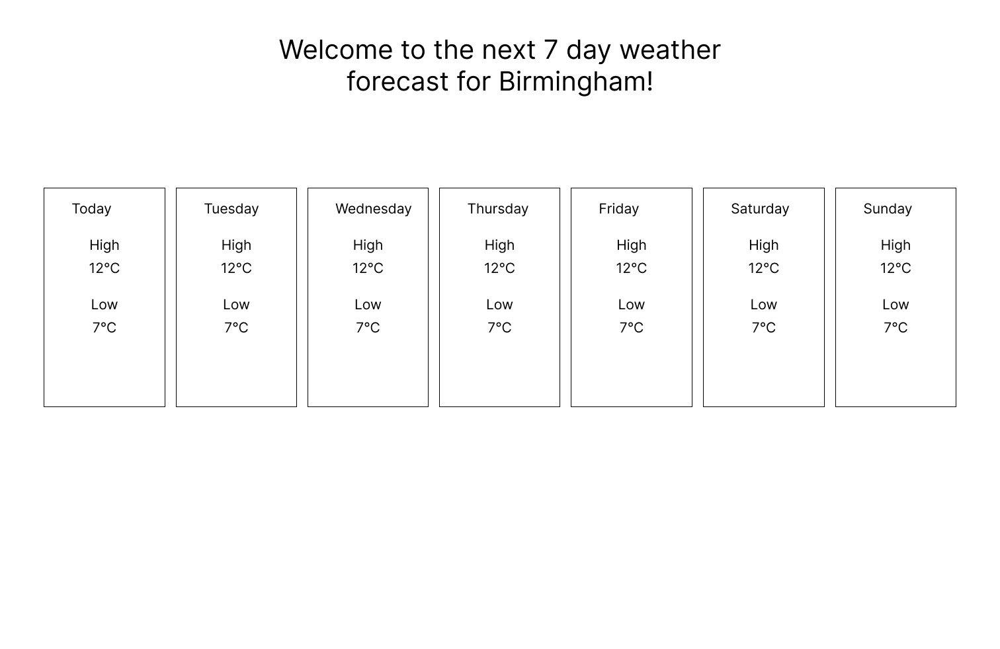

## Welcome to Eject's coding challenge repository!

We wish to build a webpage that displays a 7 day weather forecast for Birmingham, based on the simple wireframe below. We wish to use Next.js for this project. We wish to source our forecast data for this page from the [Open Meteo API](https://open-meteo.com/).

Please produce a version of this webpage that leverages actual forecast data from the API. You can utilise any development tools, information sources or packages you feel would help you complete the task. Please treat this as a pair programming exercise and discuss your thinking out loud as you proceed through the task.

This repository has been initialised with an existing Hello World page on pages/index.tsx. The Fetch package is available to make API calls. A server-rendering function has also been provisioned if you wish to leverage it.

You can ask any questions you wish. There is no right answer to this challenge, we just wish to gain an understanding of your current skill level and thinking processes!

**Example Wireframe**



The default Readme file for Next.js is published below for reference.

This is a [Next.js](https://nextjs.org/) project bootstrapped with [`create-next-app`](https://github.com/vercel/next.js/tree/canary/packages/create-next-app).

## Getting Started

First, run the development server:

```bash
npm run dev
# or
yarn dev
# or
pnpm dev
```

Open [http://localhost:3000](http://localhost:3000) with your browser to see the result.

You can start editing the page by modifying `pages/index.tsx`. The page auto-updates as you edit the file.

[API routes](https://nextjs.org/docs/api-routes/introduction) can be accessed on [http://localhost:3000/api/hello](http://localhost:3000/api/hello). This endpoint can be edited in `pages/api/hello.ts`.

The `pages/api` directory is mapped to `/api/*`. Files in this directory are treated as [API routes](https://nextjs.org/docs/api-routes/introduction) instead of React pages.

This project uses [`next/font`](https://nextjs.org/docs/basic-features/font-optimization) to automatically optimize and load Inter, a custom Google Font.

## Learn More

To learn more about Next.js, take a look at the following resources:

- [Next.js Documentation](https://nextjs.org/docs) - learn about Next.js features and API.
- [Learn Next.js](https://nextjs.org/learn) - an interactive Next.js tutorial.

You can check out [the Next.js GitHub repository](https://github.com/vercel/next.js/) - your feedback and contributions are welcome!

## Deploy on Vercel

The easiest way to deploy your Next.js app is to use the [Vercel Platform](https://vercel.com/new?utm_medium=default-template&filter=next.js&utm_source=create-next-app&utm_campaign=create-next-app-readme) from the creators of Next.js.

Check out our [Next.js deployment documentation](https://nextjs.org/docs/deployment) for more details.
